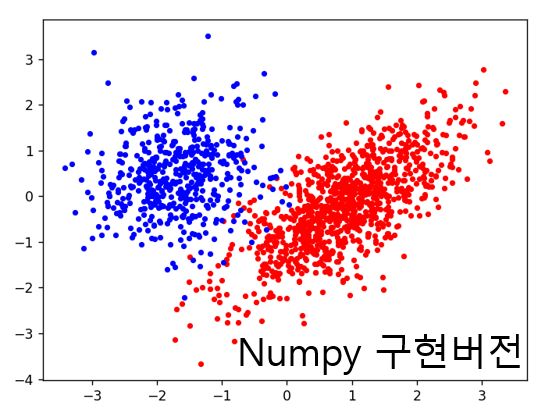
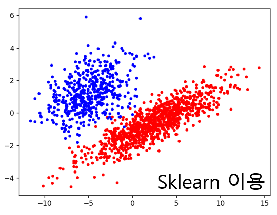
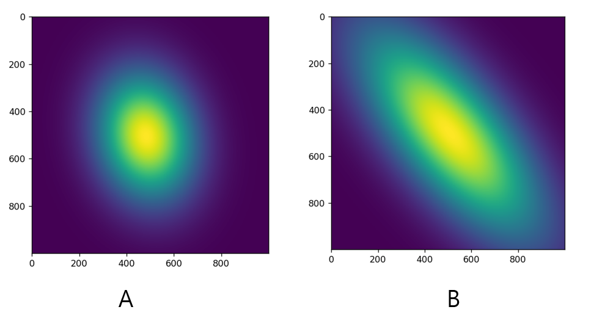
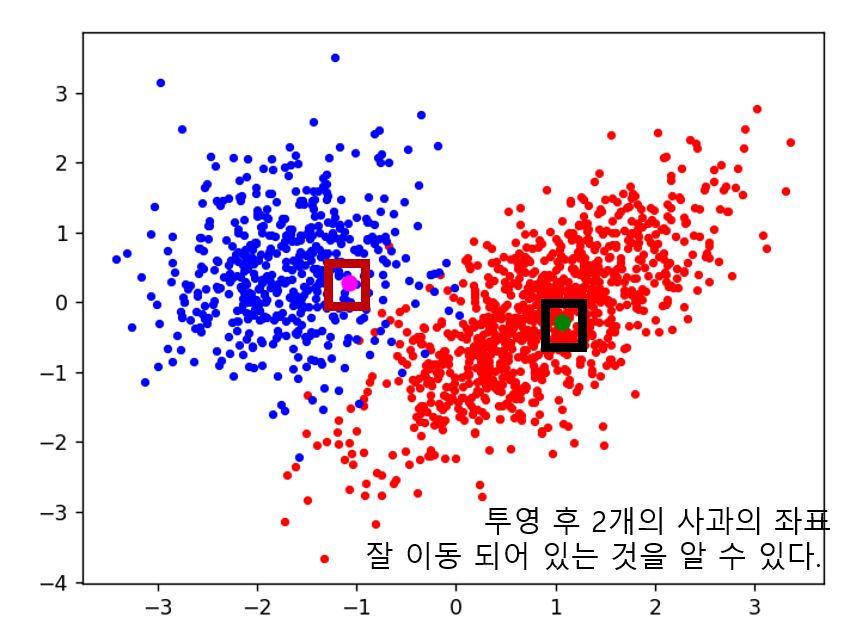

# Homework 8 

## Problems 

#### 사과 분류 

사과의 품종 A, B를 비교하기 위해 전년도에 수확한 A품종 1,000개체, B 품종 500개체 대해 당도, 밀도, 색상, 수분함량을 측정한 데이터가 있다. (데이터 파일: data_a.txt, data_b.txt).

– PCA를 이용하여 이들 1,500개 데이터의 분포를 가장 잘 설명할 수 있는 2개 의 주성분 벡터(principal component) v1, v2를 구하시오.

– 두 주성분 벡터 v1, v2에 의해 생성되는 부분공간 S를 생각하자. 원래의 1,500개 데이터를 부분공간 S에 투영한 좌표(coordinate)를 구하고 이들을 2D 평면에 가시화(visualization)하시오. 단, 구분이 용이하도록 A 데이터의 색상과 B 데이터의 색상을 달리하여 표시하시오.

– 부분공간 S에서의 A 데이터의 분포와 B 데이터의 분포를 각각 2D Gaussian 으로 모델링하시오.

– 올해 새로 수확한 사과 2개체에 대해 당도, 밀도, 색상, 수분함량을 측정하였더니 test.txt와 같은 결과가 나왔다. 이 때, 새로 측정한 데이터를 부분공간 에 투영한 후 앞서 구한 Gaussian 분포와의 ‘Mahalanobis 거리’를 계산하고 이를 이용하여 새로 수확한 사과 2개체의 품종을 각각 구분하시오.

#### eigenface , facerecognition

40명의 사람 각각에 대해 10장씩의 정면 얼굴을 획득한 이미지 DB가 있다 (att_faces.zip).

각 이미지 파일의 이름은 si_j.png (사람 인덱스 i: 1~40, 얼굴 인덱스 j: 1~10)이며 총 이미지 개수는 400장, 이미지 해상도는 56x46(HxW)이다.

각 얼굴 이미지는 56x46 = 2,576차원 데이터로 생각할 수 있다. 

각 사람의 첫번째 이미지(j=1)를 제외한 나머지 이미지들(총 360장)에 대해 PCA를 적용하여 가장 dominant한 주성분 벡터 10개를 구하고, 이들을 이미지로 도시하시오(visualization).

– 40명의 사람 중 한 명을 자유롭게 선택한 후, 해당 사람의 첫번째 이미지를 앞서 구한 주성분 벡터 k개를 이용하여 근사하고(reconstruction) 그 결과를 이미지로 도시하시오. 단, k = 1, 10, 100, 200 각각에 대해.

– 각 사람의 첫 번째 이미지를 입력하면, 해당 이미지가 DB에 있는 사람 중 누구인지를 인식하는 프로그램을 작성하고 인식 성능을 평가하시오(각 이미지를 k개의 dominant 한 주성분벡터들로 구성되는 부분공간에 투영한 좌표(feature vector)를 구하고, 테스
트 이미지의 투영좌표와 DB에 있는 이미지의 투영좌표를 비교).

– 자신의 얼굴 이미지에 대해, 앞서 방법으로 40명의 사람 중 자신과 가장 닮은 사람을 찾아서 표시하시오.

## 실행 가이드 

------------------------------

#### 1. 사과 분류 

    python apple_classification.py 

#### 실행 결과 

|Numpy implementation|Usng library(sklearn)|
|------|---|
|||

***사과 품종 분포 추정 결과***

***테스트셋 분류 결과***

result : A, B

------------------------------

#### 2. face recognition

    python get_eigen_face.py 

    처음 실행시, FaceRecognition() 함수의 pre_extract_pca_dict 인자를 None으로 하여 

    eigen vector와 eigen value를 연산. 

    이후로는 pickle 파일을 로드하는 식으로 실행 속도를 줄일 수 있다. 

    pre_extract_pca_dict="pca_data_dict.pkl"

#### 실행 결과 

***k-reconstruction***

|1|10|100|200|
|------|---|---|---|
|||||

